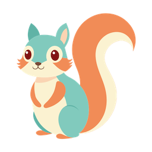

# 🐿️ lis

Minimal and alternative `ls` implementation in Rust.
This product is an example project for learning Rust and the development process of open source software.
It is not intended for production use.

## 🗣️ Overview

## ℹ️ About

### 👨‍💼​ Developers 👩‍💼

- Haruaki Tamada ([tamada](https://github.com/tamada))

### 🎃 Logo

This icon is created by [yukyik](https://www.flaticon.com/packs/cute-cartoon-illustration-17593662l) and distributed on [Flaticon](https://www.flaticon.com).
